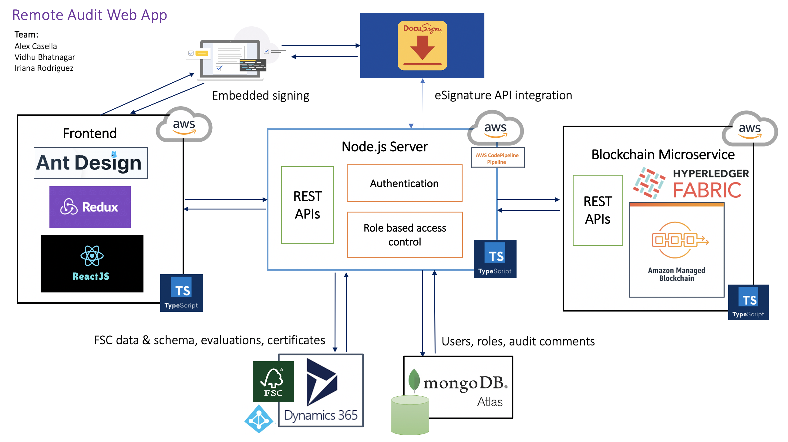

# Docusign FSC Hackathon Submission

## App 3

## Team members:

Alex Casella: Team captain, backend & blockchain developer

Vidhu Bhatnagar: Frontend developer

Iriana Rodriguez: Story-teller and coordinator

## Overview

We are passionate about giving back to our planet and contributing to the wellness of our forests. Unfortunately Covid-19 has made it difficult for the Forest Stewardship Council (FSC) Certification Body (CB) to conduct onsite audits for companies in the forest industry supply chain. On the other hand, these companies also have a much harder time with obtaining a Chain of Custody Certification (CoC) from the FSC. To resolve this problem, we have built a web application that enables FSC auditors to virtually audit CoC applicants and issue certifications. In addition, we have built a blockchain microservice to keep track of certificates with its immutable ledger. From the forest to the end customer, our app can be used by all companies in its supply chain.

:evergreen_tree::evergreen_tree::evergreen_tree: :arrow_right: Harvesting :arrow_right: Manufacturer :arrow_right: Broker :arrow_right: Distributer :arrow_right: Printer :arrow_right: Wholesaler :arrow_right: Retailer :arrow_right: :family:

## Technical architecture



## How we built it

### Frontend UI

The frontend UI is built with React, Redux, and Ant Design.

### Backend server

Our backend server is built with Node.js and Express. We have written our server side code in Typescript for the ability to do static type checking and less error prone code.

The server stores FSC data & schema, evaluations, and certificates to Microsoft Dynamics 365. Evaluations and certificates follow the required FSC schema. In addition, the server stores user info, roles, and audit comments to MongoDB Atlas.

The server exposes the following 15 REST APIs, consumed by our UI. The decoupling of server and UI is beneficial because we can scale up the server without impacting the UI, and the UI can be swapped out as needed.

```
Get all organizations from MS Dynamics CRM
GET api/org/

Get logged in user
GET api/auth/

Login and authenticate
POST api/auth/

Register user
POST api/user/

Get all registered users
GET api/user/

Get all certificates from MS Dynamics
GET api/certificate/

Add a new certificate to MS Dynamics. When the blockchain microservice is enabled this will add a certificate to the ledger as well
POST api/certificate/

Add a new evaluation for a certificate to MS Dynamics. Evaluations are only visible to FSC, ASI, and CB
POST api/evaluation/

Get all evaluations for a certificate from MS Dynamics
GET api/evaluation/certificate/:certificateID

Update an existing certificate's status to "Issued" in MS Dynamics. When the blockchain microservice is enabled this will update the certificate in the ledger as well
POST api/evaluation/certificate/:certificateID

Add a feedback comment for a certificate, comment is visible to CoC applicant
POST api/certificate/:certificateID/add_comment

Get all feedback comments for a certificate
GET api/certificate/:certificateID/comments

Get Docusign access token with authorization code
GET api/docusign/token

Get embedded signing URL for FSC Trademark License Agreement
POST api/docusign/agreement

Get embedded signing URL for FSC Certificate Template
POST api/docusign/final_certificate
```

We have also added an authentication middleware for role based access control of our APIs. The following is achieved:

- Only CB auditor can add an evaluation comment. These evaluations are only visible to CB, FSC, and ASI.
- Only CB auditor can issue a certificate and update a certificate.
- Both CB auditor and CoC applicant can make comments back and forth on evidences. As shown in the chat box feature of our UI.

In addition, we have integrated with DocuSign's eSignature APIs. The CoC applicant is required to sign the FSC Trademark License Agreement and the CB auditor is required to sign the FSC Certificate using embedded signing ceremonies.

For our demo, the server is deployed to AWS.

### Blockchain microservice

Our blockchain microservice is built on top of Hyperledger Fabric. Hyperledger Fabric is an open source private permissioned blockchain framework. It provides an immutable source of truth for each certificate issued by the FSC. The microservice server is built with Node.js and Express. The server side code is written in Typescript. The server calls Hyperledger Fabric's Contract APIs to communicate with the blockchain network.

The smart contract chaincode is written in Typescript as well. The smart contract consists of 4 functions: create certificate, read certificate, delete certificate, and update existing certificate's status to "Issued". The smart contract is ready to be hosted on IBM's Blockchain Platform service or AWS's Amazon Managed Blockchain service.

Certificate object in the blockchain ledger:

```
@Object()
export class Certificate {
  @Property()
  public certificateID: string;
  public type: string;
  public company: string;
  public issuer: string;
  public issuanceDate: string;
  public status: string;
}
```

The microservice exposes 3 REST APIs, called by the backend server:

```
Add a certificate to the blockchain's world state DB
POST api/blockchain/certificates

Update a certificate's status to "Issued" in the world state DB
POST api/blockchain/certificates/:certificateID/issue

Get a certificate back
GET  api/blockchain/certificates/:certificateID
```

We have made it optional for the backend server to connect to the blockchain microservice. In the backend server, the config setting is the `enable_blockchain` field in `src/config/config.ts`. After the chaincode is deployed to IBM or AWS, this option can be turned on, and the microservice's server can be started. When this is enabled, the backend server will call the `POST api/blockchain/certificates` API when creating a certificate in Microsoft Dynamics CRM DB, which will create a record in the blockchain ledger. It will also call the `POST api/blockchain/certificates/:certificateID/issue` API when updating the certificate's status in Dynamics DB.

## What's next for this project

We are proud to have gotten this far in our spare time in 2 months. However, there are a few improvements to be made if the FSC would like to use it in production.

Improvements:

- Enhance authentication and restrict access to more APIs.
- Enhance the blockchain microservice; the smart contract should support more features to allow more parties to invoke the blockchain and achieve a "network effect".

Thank you Docusign and FSC for the opportunity to learn, give back, and compete in this hackathon.

:deciduous_tree::deciduous_tree::deciduous_tree::deciduous_tree::deciduous_tree:
